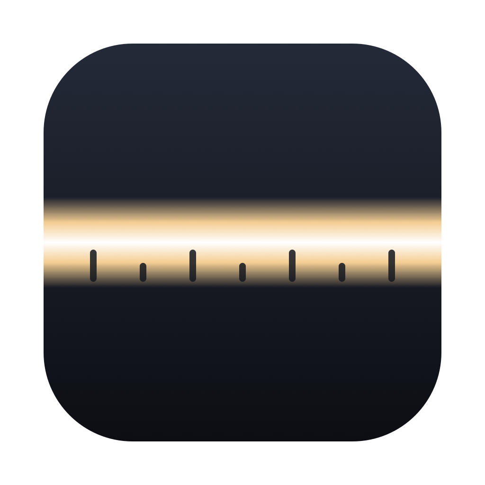
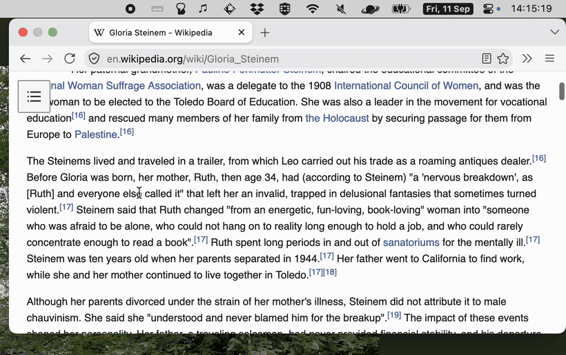
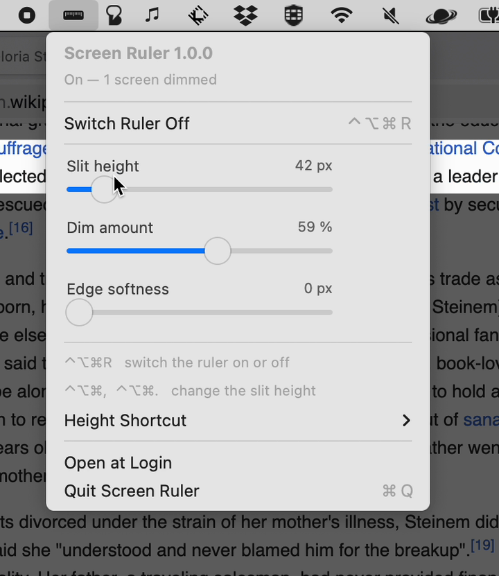

<div align="center">



# Screen Ruler

**Dims everything but the line you are reading.**

A bright slit follows your pointer down the page.
Every click still goes through to the app below.




<sub><a href="docs/demo.mp4">Longer clip with the settings (MP4)</a></sub>

</div>

---

Long pages are difficult to read when everything asks for attention at the same
time. A paper reading ruler solves this: you put a card below the line and the
rest of the page goes away. Screen Ruler does the same on the screen. The slit
follows the pointer, therefore your hand keeps the place, and every click still
goes to the app below.

## Install

```sh
git clone https://github.com/AdamSzakal/screen-ruler.git
cd screen-ruler
./build.sh install        # builds, then copies to /Applications and starts it
```

`./build.sh` alone puts `ScreenRuler.app` in `build/`. You need the Xcode
command line tools. The result is a universal binary (Apple silicon and Intel)
with an ad-hoc signature, thus it runs on your own machine without a developer
account.

Then open the menu of the app and switch **Open at Login** on.

## Use

| Action | What happens |
| --- | --- |
| Click the menu bar icon | The menu opens: status, settings and shortcuts. |
| `⌃⌥⌘R` | Switches the ruler on or off, from any app. |
| `⌃⌥⌘.` | Makes the slit higher. Hold the key to continue. |
| `⌃⌥⌘,` | Makes the slit lower. |

The slit moves to a new height with a short animation. All settings stay after
a restart.



| Setting | Range |
| --- | --- |
| Slit height | 12 to 300 px |
| Dim amount | 10 to 95 % |
| Edge softness | 0 to 80 px, the soft edge above and below the slit |
| Slit colour | No colour, one of eight presets, or your own colour |
| Colour strength | 4 to 45 % |

<br clear="right">

### Colours

A reading ruler on paper is a transparent coloured strip. Many readers find
one colour more comfortable than the others, therefore the **Slit Colour**
submenu holds the usual overlay colours:

Butter · Peach · Rose · Lilac · Sky · Aqua · Mint · Grey

**Custom Colour…** opens the colour picker of macOS. The slit follows the
picker while you move in it, thus you see the result immediately. The overlay
goes below the picker while it is open, so that the colours in the picker keep
their true look.

The colour lies over the slit only, and it fades out at the two ends together
with the dark part. **No Colour** gives a clear slit again.

### Height shortcut

Some pairs are already in use by other tools — Rectangle, for example, uses
`⌃⌥⌘` with the arrow keys. The **Height Shortcut** submenu therefore gives four
pairs:

| Pair | Note |
| --- | --- |
| `⌃⌥⌘ ,` and `⌃⌥⌘ .` | Default. |
| `⌃⌥⌘ −` and `⌃⌥⌘ +` | `⌃⌥⌘ =` works too. |
| `⌃⌥⌘ J` and `⌃⌥⌘ K` | |
| `⌃⌥⌘ ↓` and `⌃⌥⌘ ↑` | Rectangle and other window tools often use this pair. |

A pair is written as **characters**, not as key positions. The app asks the
keyboard layout which key makes the character, therefore `⌃⌥⌘+` is the "+" key
on a Swedish keyboard and `⇧=` on a US keyboard. A pair that your layout cannot
make with `⇧` only is grey in the menu. A change of the layout registers the
keys again.

The height keys exist only while the ruler is on. While it is off, the key
combinations go back to the other apps.

## No permissions

The app asks for **no accessibility permission and no screen recording
permission**:

- The pointer position comes from a poll of `NSEvent.mouseLocation`, not from an
  event tap.
- The shortcuts use the Carbon hot key API, which also holds the keys back from
  the app below.

## How it works

- One transparent window covers each screen, above the menu bar, the Dock and
  full screen apps. The windows let all clicks through, thus the app below stays
  fully usable.
- Each window holds two dark gradient layers: one above the slit, one below it.
  A timer reads the pointer 60 times a second and changes the size of the two
  layers. Nothing is drawn again, therefore the work for the GPU is very small.
- The same timer eases the drawn slit height to the height of the setting. Each
  frame covers a quarter of the distance that is left, thus a change of the
  height is a short, smooth movement.
- While the menu of the app is open, the windows go below the menu level, so
  that the menu stays easy to read.
- A screen with no pointer on it stays fully dark.

## Files

| File | Content |
| --- | --- |
| `Sources/ScreenRuler/AppDelegate.swift` | Menu bar item, menu, shortcuts. |
| `Sources/ScreenRuler/OverlayController.swift` | Windows for each screen, pointer, animation. |
| `Sources/ScreenRuler/OverlayWindow.swift` | The click-through window. |
| `Sources/ScreenRuler/RulerView.swift` | The two dark layers and the slit. |
| `Sources/ScreenRuler/SliderMenuItemView.swift` | A slider row in the menu. |
| `Sources/ScreenRuler/GlobalHotKey.swift` | The shortcuts (Carbon API). |
| `Sources/ScreenRuler/SlitShortcut.swift` | The four key pairs for the height. |
| `Sources/ScreenRuler/KeyboardLayout.swift` | Character to key, for your layout. |
| `Sources/ScreenRuler/Settings.swift` | Values in UserDefaults. |
| `Tools/MakeArtwork.swift` | Draws `docs/icon.png`, the icon of the app. |

## License

MIT
